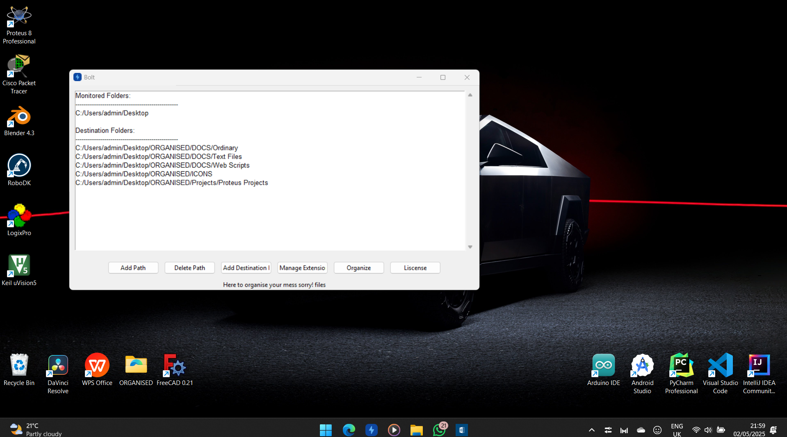

<h1>
  File Organiser
</h1>

  This is a simple python program that organises files from "downloads folder" and "desktop folder". It runs always and is launched on boot up , which makes it a no brainer(Windows only for now).
  
  You can download the EXE file and add it to this path like so "C:\ProgramData\Microsoft\Windows\Start Menu\Programs\Startup\fileOrganiser.exe"

   
 

### :camera: Screenshots

